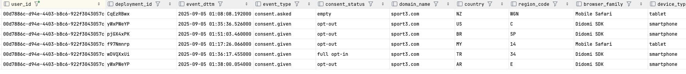
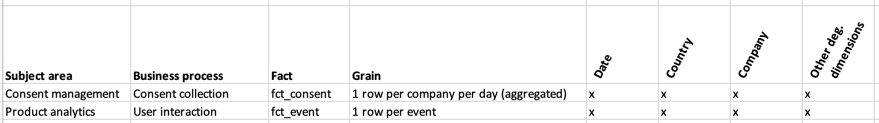
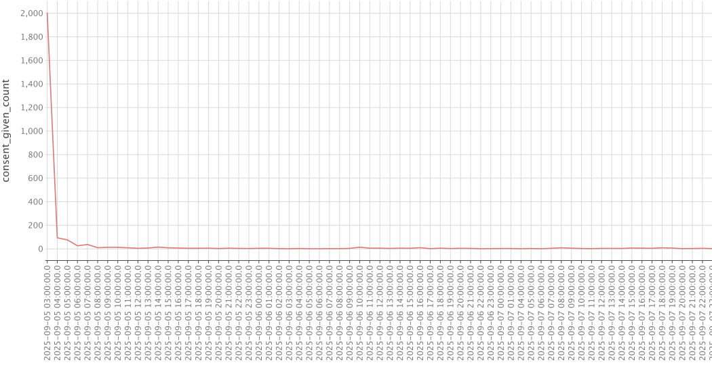
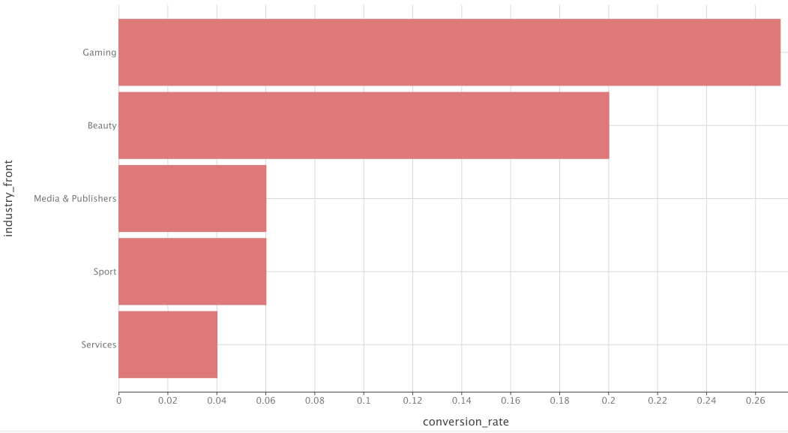
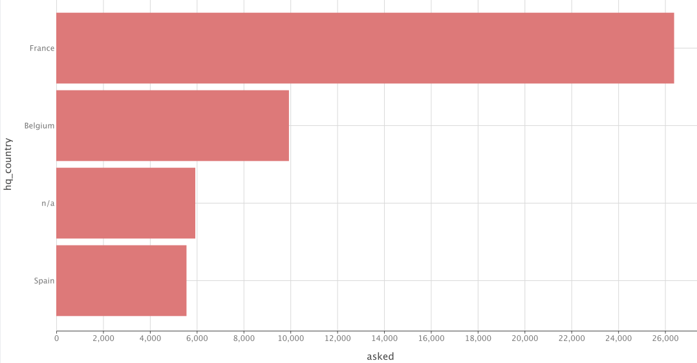

## Project overview
The project implements an end-to-end data pipeline for consent management analytics. It ingests multi-format event data (CSV, Parquet) using a DuckDB-based loader into Postgres, then transforms it with dbt into a dimensional data model (facts and dimensions) optimized for analysis and reporting.

## How to run the solution

Introduced Python Dependencies
- duckdb — for loader capabilities from file to PostgreSQL  
- pyyaml — for loader configuration support
- dbt_util — dbt helpers (eg. surrogate key generator)

Steps to run the solution

```bash
make build      # build Docker images and start containers
make load       # load data from input files (CSV and Parquet) into PostgreSQL
make deps       # install dbt dependencies
make seed       # seed reference data (dbt)
make dbt-run    # execute all dbt transformations

# Optional commands
make dbt-test   # execute all dbt tests
make dbt-docs   # generate and serve documentation (accessible at http://localhost:8080)
```
---
JDBC Client Connection

| Parameter | Value |
|------------|--------|
| User | `ae_interview` |
| Password | `password` |
| URL | `jdbc:postgresql://localhost:5432/postgres` |

---

Generic queries
```sql
select * from raw.events limit 10;
select * from raw.country_and_industry limit 10;

select * from mart.dim_company limit 10;
select * from mart.dim_country limit 10;
select * from mart.dim_date limit 10;
select * from mart.fct_event limit 10;
select * from mart.fct_consent limit 10;

select * from report.consent_company_day limit 10;
```

Quality check queries
```sql 
-- Raw company event count on '2025-09-05'
--   cnt = 64937
select sum("COUNT" / "RATE") as cnt
from raw.events
where "APIKEY" = '7725cda3-efd1-440b-8cc4-f80972acee43'
  and date("EVENT_TIME") = '2025-09-05';

-- Reporting table check (expected to match above result)
--   event_count = 64937
select event_count, *
from report.consent_company_day
where company_id = '7725cda3-efd1-440b-8cc4-f80972acee43'
  and date_day = '2025-09-05';
```
## Data quality observations

No quality issues were found on crucial event columns (`company_id` and `event_id`).

Data issues
- The `experiment` column was empty and therefore excluded.
- `country_code` and `region` required trimming (eg., `"ES"` with extra quotes) to correctly match `dim_region`.
- In `fct_event`, event count values were rounded using `round()` to remove floating-point noise in the raw table and ensure consistent grouping.
- Some companies were missing headquarters information (7 out of 40).

Other issues
  - Missing link between `consent.asked` and `consent.given`
    - No session identifier was present to reliably match the two event types, making the metric challenging to calculate accurately.
    - Supporting logic exists in `stg_event`, but the metric was not included in the final `fct_event`.

- Non-empty consent on `consent.asked` events
  - In 8 cases, `consent.asked` events contained consent statuses such as `full opt-in` or `opt-out`, which are expected only after a `consent.given` event and may indicate anomalies.

- Empty consent on `consent.given` events
  - In 256 cases, `consent.given` events had `empty` as the consent value, suggesting potential SDK or banner issues.
  - It was explained that in some jurisdictions (eg., the US), this may still represent a valid scenario.

- Inconsistent geo/device/deployment switching
  - The same `user_id` appears across different countries, regions, devices/browsers and deployment_id configurations within short time windows (eg., ~30 minutes between New Zealand and the United States).




## Architecture decisions
### Data architecture

The project follows a typical DWH layered structure consisting of:  

- `raw` — untransformed source data loaded *as-is* from operational systems or files.  
- `staging` — serving as an ephemeral preparation layer for modeling.  
- `mart` —  curated dimensional models (facts and dimensions) optimized for analytical workloads.  
- `report` — contains datasets tailored to specific dashboards needs; these tables are not intended for enterprise-wide sharing.

The `raw` layer is designed to retains the full source history, allowing reprocessing in case of data-quality or transformation issues without re-extracting data from sources.

### File loader


Design Goals
- Simple design
- High performance, robustness, and flexibility (support for CSV, Parquet, etc.)  
- Easy development (eg., direct Parquet file exploration)  

Evaluation 
- Dataframes
  - Pandas — good for small/medium datasets; memory-heavy and slower on large files. 
  - Polars — very fast, multi-threaded engine; good fit for large data, Python-friendly. 
- Postgres extensions (eg., pg_parquet)
  - fast but less portable; often unsupported on managed Postgres.
- DuckDB
  - SQL based, fast, portable, supports parallel reads, direct Postgres integration

Decision
- DuckDB was chosen for its parallel file loading and broad format and integration support. 
- It fits naturally into the SQL ecosystem, enabling both ingestion and ad-hoc data exploration without additional tools. 

Concept:
- The loader follows a load-first, clean-later approach: all data is ingested as-is before transformation. This keeps the process simple, robust and less error-prone. 
- The script provides a generic, metadata-aware ingestion for CSV and Parquet files using DuckDB as an intermediary engine and Postgres as the target system. 

Key features:
- Automatic schema handling 
  - can infer structure from input files or enforce explicit schemas via JSON definitions.  
- Format flexibility
  - supports both CSV and Parquet using DuckDB’s built-in functionality.  
- Metadata tracking
  - maintains a `load_metadata` table in DuckDB to track load status (`loaded`, `failed`) and prevent duplicate ingestion of already loaded files.  
- Write modes
  - supports `append` and `truncate_append` dispositions for flexible reloading.  
- Incremental awareness
  - automatically identifies new files and skips previously loaded ones unless `--force-load` is used.  
- Schema creation
  - ensures target Postgres schemas exist and creates tables dynamically if missing.  
- Lightweight setup
  - no external ETL framework; entirely Python-based with DuckDB handling file I/O and SQL execution.  
- Local and container mode — switchable via environment variable:  

Example:
```bash
python loader.py \
  --filename "../input/events/*/*" \
  --table events \
  --write-disposition truncate_append \
  --force-load
```

### dbt

#### Structure
Project structure follows standard dbt practices, with separate folders representing data layers (raw, staging, marts, reporting). Each folder maps directly to a physical database schema, making it easy to locate corresponding tables and models.

In larger organizations with several department (eg. marketing, sales, consent-management), an additional subfolder level could be introduced in the `staging` and `mart` folder. To keep a flat structure, such organizational context can also be encoded in model names (eg. `fct_cm_event`), improving table uniqueness across departments. The `raw` layer can similarly be organized by source systems when dealing with a large number of sources.

Schema mapping logic is customized via [generate_schema_name.sql](dbt_project/macros/generate_schema_name.sql).  

For simplicity, `profiles.yml`, `dbt_project.yml`, and `packages.yml` are all stored in the project root.

Due to small project size, all **schemas, seeds,** and **sources** are defined in single files (`schema.yml`, `seeds.yml`, `source.yml`) under `/models`.

#### Macros
Jinja templating adds flexibility but can reduce readability and maintainability. 
Macros were used only when necessary to keep the solution simple and maintainable.  

The project reuses community packages (eg. `dbt_utils.generate_surrogate_key()`) instead of re-implementing standard utilities.

#### Materialisation
Materialisations are crucial for efficient data processing and performance. For simplicity and easier maintenance, the default materialisation has been changed from `view` to `table`. An exception to this are fact models, where incremental materialisation is used.

Incremental strategies are covered in the section [Load & backfill strategies](#load--backfill-strategies).

#### Data & code checks  
Several tests were created to demonstrate dbt testing functionality.  
They are defined both in the `schema.yml` files and in the dedicated `tests` folder.

Types of tests applied in the project:  
- Generic tests
  - dbt-provided tests  
  - Example: `not_null` test on `company_id` in `consent_company_day` ([schema.yml](dbt_project/models/schema.yml)).  
- Generic custom tests
  - Project-defined reusable tests ([schema.yml](dbt_project/models/schema.yml)).  
  - Example: [is_positive()](dbt_project/tests/generic/is_positive.sql) custom test in `schema.yml` for `consent_company_day`.  
- Singular tests
  - Model-specific SQL assertions stored in `/tests/singular/`.  
  - Example: [count_check_company_7725_date_20250905.sql](dbt_project/tests/singular/count_check_company_7725_date_20250905.sql).  
- Unit tests — tests validating transformation logic and expected outputs of models, defined in `/tests/unit/`.  
  - Example: [test_stg_consent_basic_flow.yml](dbt_project/tests/unit/test_stg_consent_basic_flow.yml).

Example runs:
```bash
# Run all tests in the project
dbt test

# Run tests only for a specific model
dbt test -s consent_company_day
``` 

Tests can be executed as part of CI/CD pipelines or a broader continuous data quality framework.

They ensure schema integrity, data validity, and correctness of transformation logic throughout the project lifecycle.

#### Tags  
Tags in this project are primarily used to support external scheduling, simplify production operations, and enable cost tracking across subject areas.  

Example: running an incremental load for the entire `consent-management` domain:  
```bash
dbt run -s tag:cm
````

#### Load & backfill strategies  

The project implements multiple loading and transformation strategies.  

- File loader:  
  - Full load – triggered with the `--force-load` option. The write disposition `truncate+append` can be used to clear the target table before reloading.  
  - Incremental load – the default loader mode. It tracks which files have already been loaded and processes only new or modified files.  

- dbt models:  
  - Full load – performed using dbt’s built-in `--full-refresh` option to completely rebuild models.  
  - Incremental load – uses dbt’s incremental materialization with configurable reload period.  

- Incremental strategies:  
  - Since the events data in consent management is large, incremental processing is essential.  
  - This project uses the `delete+insert` incremental strategy. Its main drawback is that backfills require scanning the full `_uq` (unique key) column, which is often neither partitioned nor clustered, potentially leading to performance issues during large deletions or merges.
  - For high-volume data, using a `microbatch` approach can improve performance when relying on partitioned or clustered keys. This approach also simplifies models by reducing boilerplate code for handling `start_date` and `end_date` variables, as this logic is managed automatically by the framework through passed arguments.


- Backfills:  
  - Supported in fact tables (eg., [fct_event.sql](dbt_project/models/mart/fct_event.sql), [fct_consent.sql](dbt_project/models/mart/fct_consent.sql)).  
  - Controlled by date variables (`start_date`, `end_date`).  
  - By default, daily runs reload yesterday’s and today’s data.  
  - Custom backfills can be triggered by overriding variables at runtime:  
    ```bash
    dbt run -s +consent_company_day --vars '{"start_date": "2025-09-05", "end_date": "2025-09-06"}'
    ```    


### Modeling  
The solution is designed around two modelling approaches:

- **Dimensional modelling**, intended for standardised, enterprise-wide adoption. This approach supports business processes via fact tables and provides context through dimension. The target schema is `mart`.  In the assignment two main subject areas were covered: `Consent management` and `Product analytics` for tracking user interactions (events). 

    

    *Figure: Didomi challenge bus matrix*


- **Wide-table modelling**, used exclusively for specific dashboards and performance-driven analyses. This is implemented in schema `report`, and is not meant to be shared broadly across teams.


#### Naming standards
The project follows consistent naming conventions aligned with common data warehousing practices.

Table types
- `stg_` — staging tables; used for normalization and preparation of raw data.  
- `dim_` — dimension tables.  
- `fct_` — transactional fact tables describing business process performance.  

Attribute conventions
- `_sk` — surrogate key.  
- `_fk` — foreign key.  
- `_uq` — unique key made by combining several fields. Mainly used in fact tables to simplify maintenance.
- `_id` — natural or business identifier from source data.  
- `_code` — standardized code values (eg, ISO country code).  
- `_no` — numeric business identifiers (eg., invoice_no).  
- `_flag` / `_ind` — boolean or indicator fields (Y/N).  
- `_dttm` — timestamp field.  
- `_dt` — date type field.
- `valid_from`, `valid_to` — validity columns for dimensions (non-historical in this challenge, but included for consistency).
- `_count` - numeric count of events, records, or actions
- `lag_` - time difference between milestones


Metadata columns
- `run_id` — dbt execution identifier for lineage and troubleshooting.  
- `ingest_dttm` — timestamp of data ingestion.  
- `update_dttm` — timestamp of last record update (if applicable).  
- `origin` — data origin, typically file name or source system reference.  

#### Surrogate keys and their role
When creating surrogate keys and defining relationships between facts and dimensions, several approaches exist. Two of them are outlined below:
- Early-binding approach:  
  in traditional dwh design, surrogate keys (sk) are generated within dimensions as independent, sometimes random unique identifiers. When loading fact tables, fact data is joined to dimensions on the business key (and time fields for scd handling) to fetch the correct sk.  
  The resulting fact record points directly to a unique, time-specific dimension row.  
  *Drawback:* facts depend on preloaded dimensions, increasing processing time, complexity and coupling.


- Late-binding approach:  
  In this approach, fact table foreign keys do not reference a unique dimension row when history is tracked (SCD dimension).  
  Surrogate keys in these facts are derived directly from the business key, without joining to the dimension during loading.  
  Historical context is resolved at query time, when users apply time-based filters to pick the valid dimension record.  
  *Drawback:* This approach simplifies loading and decouples facts from dimensions, but shifts responsibility to consumers.  
  If time filters are misapplied, it can cause incorrect results which represent a major risk.


In the prototype challenge, a **late-binding** strategy was applied for flexibility and simplicity. For production environments, a hybrid or early-binding approach is advisable to ensure data stability and reduce risk for less experienced users.

#### Dimensions
Following Kimball dimensional modeling principles, several potential dimensions were considered to be created or derived from the provided raw event dataset: `dim_device`, `dim_event_type`, `dim_consent_status`, `dim_experiment`, `dim_domain`, `dim_deployment`, `dim_user`, `dim_vendor`,..  
 
These dimensions were **not implemented** as separate entities. Instead, their attributes were kept as **degenerate dimensions** within the fact table (stored directly in `fct_event` without foreign keys).

This decisions was taken because:
- Each of these entities currently contains only one or two attributes, which would not justify the overhead of creating a new dimension.  
- Within the assignment scope, no additional descriptive or lookup attributes (eg., labels, hierarchies, textual descriptions) were identified as necessary to include.
- Avoiding unnecessary joins improves model simplicity and query performance.  

The decision is a **design compromise**. Typically, dimensional attributes are externalized to dedicated dimension tables to support reuse, hierarchy navigation, and descriptive enrichment.

In a future production setup, these degenerate dimensions would likely evolve into fully developed conformed dimensions, supporting:  
- richer attribute context (eg. device families and other atriburtes, user segments, ..),  
- drill-down / roll-up capabilities in reporting,  
- consistent reuse across multiple fact tables.

As part of the assignment the following dimensions were implemented: 
- `dim_company`
- `dim_country`
- `dim_date`

Each dimension also includes the default row to handle unmatched fact records. Dimensions currently do not track any history.

#### Facts
Fact tables capture business processes that are relevant to the organisation. Two fact tables were created:

`fct_event`  
- Transactional fact capturing all user and consent-related events collected from Didomi SDKs and APIs. Each record represents a single tracked event (the lowest granularity). Includes both behavioural events (`pageview`, `ui.action`) and consent interaction events (`consent.asked`, `consent.given`).  
- Grain: one record per event  
  - This grain was chosen because the table serves as an entry point not only for consent-related analytics but also for other types of product analytics that may require event-level granularity.
  
`fct_consent`  
- Aggregated fact table containing consent metrics per company per day. It includes counts of different event types and consent statuses.  
- Grain: one record per company per day  
  - A daily grain was chosen primarily to aggregate the large volume of consent data. For more granular event-level analysis, the grain would need to be reduced to one record per given consent.

Fact loading concept:
- Facts are incrementally loaded using dbt's built-in incremental materialisations.
- The stage table drives the load into the fact (here is defined the load period and keys for the `delete+insert` process).  
- A unique key is used to delete existing records from the target fact, enabling backfills for any defined period. 
- Target records are deleted based on distinct keys from the stage table.  
- This requires a full column scan of the target unique key column during deletion.  
- In incremental mode, dbt creates an additional `_temp` table populated from the stage.  
- Event-time filters are applied only when loading the stage table — the fact load itself does not need them.  
- Additional performance improvements could be achieved using dbt predicates or microbatching.  
- Both facts support reloads for any user-provided period.

Reload example:

```bash
dbt run -s +fct_consent --vars '{"start_date": "2025-09-05", "end_date": "2025-09-06"}'
```

An additional reporitng table was created to fullfill the challenge metrics requirement (`report.consent_company_day`)

#### Time standardization (UTC)
Timestamps used for linking facts and dimensions are standardized to UTC to ensure consistent across systems.
End-user reporting or presentation layers may apply local time zone conversions as needed. In this challenge, such conversions were not implemented.

## Key Insights

- Companies show generally low consent conversion rates, with most below 10%. The top-performing companies reach around 27% conversion overall.  

  

- Data insights:
  - 40 companies exist in the raw dataset, but only 10 generated events.  
  - The dataset covers a period from `2025-09-05` to `2025-09-10`.  
  - A notable spike in `consent.given` events occurred on `2025-09-05 01:00` (~2004 events), likely due to synthetic test data.  

  

- Industry patterns:  
  - Gaming and Beauty industries significantly outperform others, reaching 27% and 20% conversion rates respectively.  
  - Other industries remain below 10%, suggesting different user trust or banner design patterns.  

  

- Geographic distribution:  
  - Most `consent.asked` traffic originates from companies with headquaters in France, generating nearly 3x more events than other countries.  
  - Several companies have undefined headquarters (HQ), indicating a data-quality issue that should be addressed in upstream sources.  

  


## Caveats & notes
- Performance and computation  
  - DuckDB loader performance can be further improved by increasing the number of row groups in Parquet exports or by using dedicated `read_csv()` / `read_parquet()` functions that accept multiple files directly in the `FROM` clause. This approach enables full parallelization of file reads. It was intentionally omitted in the current version to keep the loader simple, as files are currently processed iteratively.
  - SQL window functions, while powerful, can be resource-heavy. For metrics like average time-to-consent, it is more efficient to calculate them directly in the SDK instead of scanning large event partitions.
  - Incremental materializations in dbt rely on temporary tables (`_temp`), which cannot be skipped. Further optimization would require a custom materialization, but this adds maintenance overhead.

- Semantic modeling  
  - For more dynamic metric calculations (eg., hourly, daily, monthly), a semantic layer (dbt metrics or Snowflake semantic models) can be introduced. This ensures consistent metric definitions across tools, though performance should be considered given the large size of raw events.

- Loader behavior  
  - The DuckDB loader preserves column case, which can make column handling in staging less convenient.  
  - Files without headers automatically receive generic column names (`column01`, `column02`, …).

- Development environments  
  - Introduced a single Docker variable `RUN_MODE` to support both local and container runs; Docker profiles were not added since only one toggle was needed.  
  - For local development, set environment variables before execution:
    ```bash
    export RUN_MODE=local
    export DBT_TARGET=local
    ```


## Appendix
### Benchmark INSERT INTO vs COPY TO
A quick benchmark comparing the INSERT INTO and COPY commands showed no significant difference in load performance when using DuckDB to load data from Parquet files into Postgres. Therefore, due to greater flexibility (e.g., the option to add timestamp and filename columns), the solution is implemented using the INSERT INTO command.
```sql 
-- 1. Generate synthetic data: 10M rows with 5 random columns
create table bench_data as
select
    range as id,
    random() as col_a,
    random() as col_b,
    random() as col_c,
    md5(random()::varchar) as col_d,
    (random() * 1000)::int as col_e
from range(10000000);

-- 2. create tables
create table pg.raw.bench_insert as select * from bench_data where 1=0;
create table pg.raw.bench_copy   as select * from bench_data where 1=0;

-- 3. benchmark 1: insert into … select * from read_parquet
-- 10,000,000 rows affected in 22 s 263 ms
-- 10,000,000 rows affected in 25 s 46 ms
insert into pg.raw.bench_insert select * from read_parquet('/tmp/gen_data_10m.parquet');

-- 3. benchmark 2: copy … from parquet
-- 10,000,000 rows affected in 21 s 479 ms
-- 10,000,000 rows affected in 25 s 154 ms
copy pg.raw.bench_copy from '/tmp/gen_data_10m.parquet' (format 'parquet');

-- 4. sanity check: row counts
select
  (select count(*) from pg.raw.bench_insert) as insert_count,
  (select count(*) from pg.raw.bench_copy) as copy_count;

```
### DuckDB database access limitation

DuckDB does not support simultaneous access to the same database file from multiple processes (eg. load_metadata table).
When one process holds a write connection (eg, the Python loader), any additional process even in read-only mode (eg, DataGrip) will trigger a file lock conflict.

This behavior is intentional: DuckDB enforces exclusive file-level locking to preserve transactional integrity, meaning only a single process can safely read or write to a `.duckdb` file at a time.  
